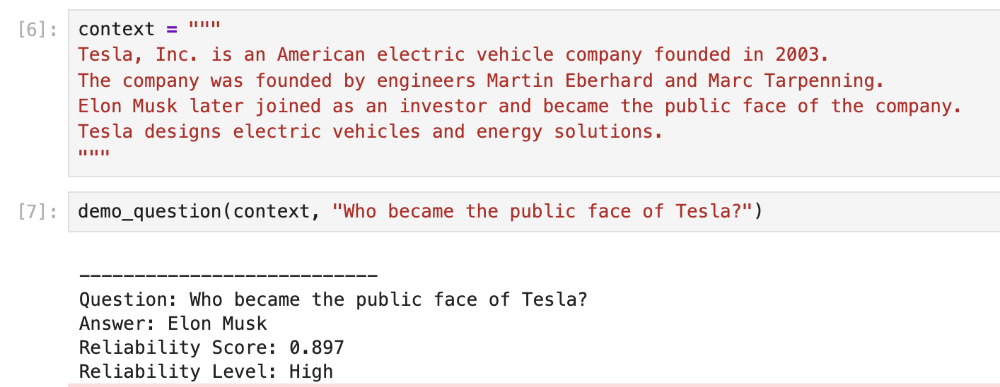
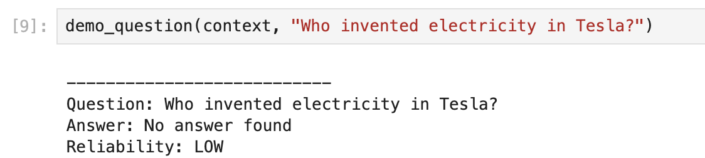

# Reliability-Aware BERT Question Answering

A research-oriented NLP project that extends traditional BERT-based Question Answering systems with uncertainty-aware reliability scoring.

The system not only predicts answers from a given context, but also estimates how trustworthy the generated answer is using uncertainty signals extracted from internal BERT outputs.

---

# 🚀 Features

- BERT-based Extractive Question Answering
- Reliability Estimation using Uncertainty Signals
- Entropy-based Confidence Analysis
- Random Forest Reliability Classifier
- Balanced Dataset Training
- No-answer (`[CLS]`) Detection
- Reliability Levels:
  - High
  - Medium
  - Low

---

# 🧠 Problem Statement

Traditional Question Answering (QA) systems generate answers directly from context but do not indicate whether the generated answer is actually trustworthy.

This project addresses the problem of:

> **Answer Reliability Estimation in Question Answering Systems**

by introducing an uncertainty-aware reliability prediction layer on top of a BERT QA model.

---

# ⚙️ Tech Stack

- Python
- PyTorch
- HuggingFace Transformers
- Scikit-learn
- Pandas
- NumPy
- Matplotlib
- Seaborn
- Jupyter Notebook

---

# 🏗️ Project Pipeline

```text
Question + Context
        ↓
BERT QA Model
        ↓
Start/End Logits
        ↓
Uncertainty Feature Extraction
        ↓
Random Forest Classifier
        ↓
Answer + Reliability Score
```

---

# 📊 Uncertainty Features Used

The following uncertainty signals were extracted from BERT logits:

- Span Probability
- Start Entropy
- End Entropy
- Confidence Margin
- Mean Entropy
- Entropy Difference

These signals were used to train a Random Forest classifier for reliability prediction.

---

# 📚 Dataset

Dataset Used:

```text
SQuAD v2 Validation Dataset
```

Approximately:

```text
2000 samples
```

were used for experimentation and reliability modeling.

---

# 🤖 Model Architecture

### Base QA Model

```text
deepset/bert-base-cased-squad2
```

### Reliability Classifier

```text
Random Forest Classifier
```

---

# 📈 Mathematical Formulations

## Softmax Probability

The logits generated by BERT are converted into probabilities using Softmax.

\[
P(i)=\frac{e^{z_i}}{\sum_j e^{z_j}}
\]

Where:
- \( z_i \) = logit for token \( i \)

---

## Span Probability

\[
SpanProb = P_{start}(s) \times P_{end}(e)
\]

Where:
- \( s \) = predicted start token
- \( e \) = predicted end token

---

## Entropy

Entropy is used to measure uncertainty.

\[
H(p) = - \sum p_i \log(p_i)
\]

Lower entropy indicates:
- higher confidence

Higher entropy indicates:
- higher uncertainty

---

## Confidence Margin

\[
Margin = p_{max} - p_{second\_max}
\]

This measures how strongly the model prefers the best token over the second-best token.

---

# 📷 Demo Screenshots

## Example 1



---

## Example 2



---

# 📌 Sample Inference Output

| Question | Predicted Answer | Reliability Score | Reliability Level |
|---|---|---|---|
| Who founded Tesla? | Elon Musk | 0.82 | High |
| When was BERT released? | October 2018 | 0.51 | Medium |
| Who invented electricity in Tesla? | No answer found | 0.08 | Low |

---

# 🔬 Research Contribution

This project extends traditional BERT-based Question Answering systems by introducing:

- uncertainty-aware reliability estimation
- confidence-driven answer analysis
- interpretable reliability scoring

Instead of only generating answers, the system predicts:

> **How reliable the generated answer is**

---

# 📈 Results

Initial model suffered from class imbalance:

```text
False = 1500
True  = 500
```

Balanced dataset training was applied using undersampling:

```text
False = 500
True  = 500
```

Final balanced model achieved:
- balanced recall across classes
- improved reliability prediction
- more stable confidence estimation

---

# 🚀 Future Improvements

Potential future extensions include:

- Probability Calibration Techniques
- Monte Carlo Dropout Uncertainty
- Ensemble-based Uncertainty Estimation
- Semantic Relevance Verification
- End-to-End Neural Reliability Models
- Web Deployment using Flask or Streamlit

---

# 📂 Repository Structure

```text
reliability-aware-bert-qa/
│
├── notebooks/
│   ├── 01_training_pipeline.ipynb
│   ├── 02_demo.ipynb
│   └── 03_balanced_training.ipynb
│
├── results/
│   ├── qa_uncertainty_signals.csv
│   ├── reliability_classifier.pkl
│   └── feature_order.pkl
│
├── screenshots/
│   ├── ss1.png
│   └── ss2.png
│
├── requirements.txt
├── README.md
└── .gitignore
```

---

# 🧪 Installation

Clone the repository:

```bash
git clone https://github.com/YOUR_USERNAME/reliability-aware-bert-qa.git
```

Install dependencies:

```bash
pip install -r requirements.txt
```

Run Jupyter Notebook:

```bash
jupyter notebook
```

---

# 👨‍💻 Authors

Developed as a research-oriented NLP project focused on:

```text
Question Answering + Uncertainty Estimation + Reliability Prediction
```

---

# ⭐ Key Insight

> Modern QA systems should not only answer questions, but also communicate how trustworthy their answers are.